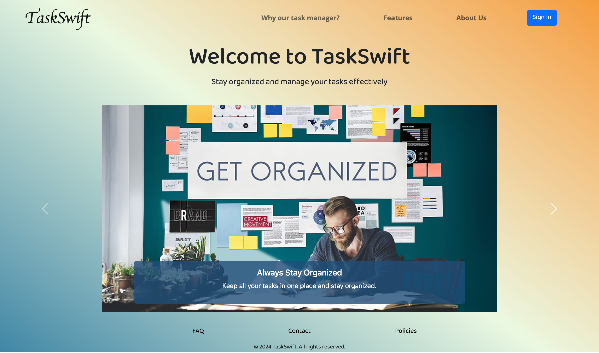
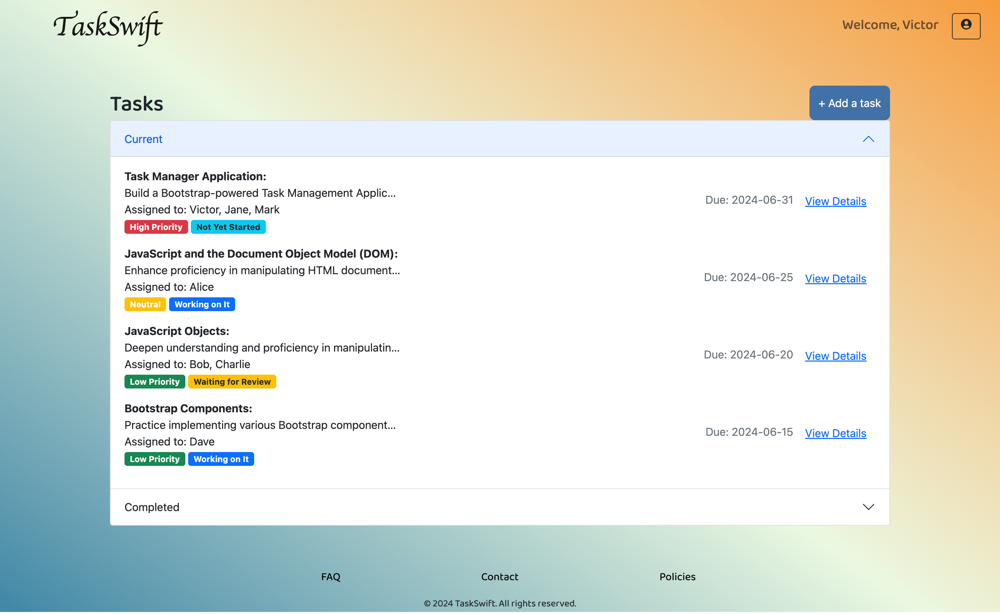

# TaskSwift

## Overview

TaskSwift is a comprehensive task management web application designed to help individuals and teams stay organized and manage their tasks efficiently. This application leverages modern web technologies, including HTML, CSS (Bootstrap), to deliver a user-friendly and responsive experience.

## Features

- **User Authentication**: Secure sign-up and sign-in functionalities.
- **Task Management**: Create, update, view, and delete tasks.
- **Task Prioritization**: Set task priorities (High, Neutral, Low).
- **Task Status Tracking**: Track task status (Not Yet Started, Working on It, Waiting for Review, Completed).
- **Teamwork and Collaboration**: Assign tasks to the right team members, make edits and get notified when the task is complete.
- **Responsive Design**: Fully responsive layout ensuring compatibility across various devices.
- **Interactive UI**: Engaging user interface with carousels, modals, and more.

## Table of Contents

- [TaskSwift](#taskswift)
  - [Overview](#overview)
  - [Features](#features)
  - [Table of Contents](#table-of-contents)
  - [Installation](#installation)
  - [Usage](#usage)
    - [Home Page](#home-page)
    - [Task Dashboard Page](#task-dashboard-page)
    - [Adding a Task and Assigning to a Team Member](#adding-a-task-and-assigning-to-a-team-member)
    - [Viewing Task Details](#viewing-task-details)
    - [Authentication](#authentication)
  - [File Structure](#file-structure)
  - [Screenshots](#screenshots)
    - [Home Page](#home-page-1)
    - [Task Dashboard Page](#task-dashboard-page-1)
  - [Technologies Used](#technologies-used)
  - [Figma Link](#figma-link)
  - [Credits](#credits)

## Installation

1. **Clone the repository**:
    ```bash
    git clone https://github.com/SylverVB/FE-HW-W2WD-Task-Management-Application-Project.git
    cd taskswift
    ```

2. **Open the `index.html` file in your web browser**:
    ```bash
    open index.html
    ```

## Usage

### Home Page

The home page (`index.html`) provides an overview of TaskSwift, highlighting its key features through a carousel. Users can navigate to the sign-in or sign-up modals from this page.

### Task Dashboard Page

The task dashboard page (`dashboard.html`) displays a list of tasks organized into "Current" and "Completed" sections. Users can add new tasks, view task details, and manage their tasks from this page.

### Adding a Task and Assigning to a Team Member

To add a new task, click the "+ Add a task" button on the dashboard. Fill in the task details in the modal that appears and click "Add Task". Assign the task to the appropriate member or group to facilitate collaboration.

### Viewing Task Details

To view task details, click the "View Details" button next to the task in the task list. A modal will appear with detailed information about the task.

### Authentication

Users must sign in or sign up to access the dashboard. Authentication is handled through modals that appear on the home page.

## File Structure

```
taskswift/
├── index.html
├── dashboard.html
├── static/
│   ├── style.css
│   └── images/
│       ├── vbgetorganized.jpg
│       ├── vbeasytouse.jpg
│       ├── vbteamwork.jpg
│       ├── vbhome-page.png
│       └── vbdashboard-page.png
├── README.md
└── ...
```

## Screenshots

### Home Page


### Task Dashboard Page


## Technologies Used

- **HTML5**: Markup language used for structuring the content.
- **CSS3**: Styling the application with a focus on responsive design using Bootstrap.
- **Bootstrap**: Ensuring a responsive and modern design.
- **Figma**: For designing wireframes and high-fidelity prototypes.

## Figma Link

For wireframes and high-fidelity prototypes, visit the [TaskSwift Figma project](https://www.figma.com/design/s3FavHr4jlQlckRcSRI0wi/TaskSwift).

## Credits

Developed by [Victor Bondaruk](https://github.com/SylverVB). Feel free to reach out for any questions or contributions.